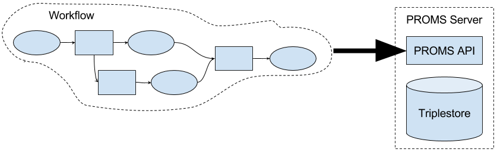
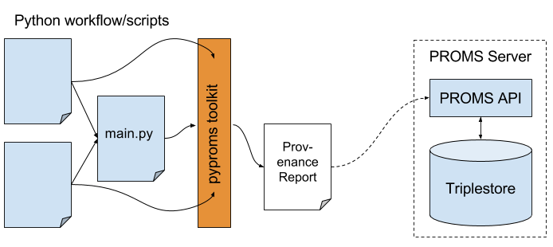

# PROMS Server
Part of an organisation's provenance solution.

## About
  
*Figure 1: PROMS Purpose*  

The main purpose of PROMS Server is to collect and store provenance information generated by workflows and automated processes. PROMS Server itself is an API that sits on top of any standard [SPARQL 1.1](https://www.w3.org/TR/sparql11-query/) triplestore and expects to receive provenance information in [RDF formats](https://en.wikipedia.org/wiki/Resource_Description_Framework). In order to use PROMS Server, you need to be able to generate provenance for your workflows, scripts or other processes using toolkits, log file processing or custom code.

*See the [promsns.org min page](http://promsns.org/) for a list of some tools you can use to generate provenance in RDF.*  

PROMS Server checks that provenance sent to it is compliant with the [PROV Data Model](https://www.w3.org/TR/prov-dm/) and a set of its own rule too designed to ensure the provenance is managed well. You can easily extend these rules for your own organisation's purposes.

## Components
PROMS Server consists of an HTTP API coded in Python 3.6 using the Flask framework. It relies heavily on the [rdflib](https://pypi.python.org/pypi/rdflib) Python module for manipulating RDF and a range of other fairly mainstream Python modules. The human HTML UI also uses the JavaScript [rdflib.js](https://www.npmjs.com/package/rdflib) code for RDF manipulation.

## Documentation
### Installation
See the [installation](installation/README.md) documents.

### Use
PROMS Server expects to receive provenance *Reports* that are files containing bundles of provenance information in an RDF format. *Reports* are sent via HTTP POST requests to the PROMS Server's API, validated and then stored in its triplestore.

 
*Figure 2: Sending a Report to PROMS Server from a Python workflow via pyproms*

Figure 2 shows PROMS Server receiving a provenance report from a Python workflow or set of scripts that is using the [pyproms](https://pypi.python.org/pypi/pyproms) Python package to log internal elements of the script into PROV-O compatible RDF. There are similar toolkits avialable for Java, JavaScript and .NET programming languages (see [promsns.org min page](http://promsns.org/)) or you could custom-code your own provenance logging.

## Contributing
We'd love to hear from you and have you participate in developing PROMS. Please drop us a line on the email addresses below in *Author & Contact*.

## Further documentation
For pretty much everything you need to know about PROMS Server and the family of tools associated with it, see <http://promsns.org/wiki/proms>.

## License
This code and all other content in this repository are licensed under the [Creative Commons Attribution 4.0 International (CC BY 4.0)](https://creativecommons.org/licenses/by/4.0/) (also [LICENSE](LICENSE)).

## Author & Contact
PROMS Server is jointly maintained by [CSIRO](http://www.csiro.au) and [Geoscience Australia](http://www.ga.gov.au).  

**Nicholas Car**  - Project Lead  
Data Architect 
Geoscience Australia  
<nicholas.car@ga.gov.au>  
<http://orcid.org/0000-0002-8742-7730>  

**Geoscience Australia Data Governance team**  
<dataman@ga.gov.au>
