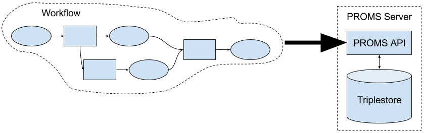

# PROMS Server
Part of an organisation's provenance solution.

## About
  
*Figure 1: PROMS Purpose*  

The main purpose of PROMS Server is to collect and store provenance information generated by workflows and automated processes. PROMS Server is an API that sits on top of any standard [SPARQL 1.1](https://www.w3.org/TR/sparql11-query/). triplestore.

PROMS Server checks that provenance sent to it is compliant with the [PROV Data Model](https://www.w3.org/TR/prov-dm/) and a few other rules designed to ensure the provenance is managed well.

## Components
PROMS Server consists of an HTTP API coded in Python 3.6 using the Flask framework. It relies heavily on the [rdflib](https://pypi.python.org/pypi/rdflib) Python module for manipulating RDF and a range of other fairly mainstream Python modules. The human HTML UI also uses the JavaScript [rdflib.js](https://www.npmjs.com/package/rdflib) code for RDF manipulation.

## Documentation
### Installation
See the [installation](installation/README.md) documents.

### Use
*Coming!*

## Contributing
We'd love to hear from you and have you participate in developing PROMS. Please drop us a line on the email addresses below in *Author & Contact*.

## Further documentation
For pretty much everything you need to know about PROMS Server and the family of tools associated with it, see <http://promsns.org/wiki/proms>.

## License
This code and all other content in this repository are licensed under the [Creative Commons Attribution 4.0 International (CC BY 4.0)](https://creativecommons.org/licenses/by/4.0/) (also [LICENSE](LICENSE)).

## Author & Contact
PROMS Server is jointly maintained by [CSIRO](http://www.csiro.au) and [Geoscience Australia](http://www.ga.gov.au).  

**Nicholas Car**  - Project Lead  
Data Architect 
Geoscience Australia  
<nicholas.car@ga.gov.au>  
<http://orcid.org/0000-0002-8742-7730>  

**Geoscience Australia Data Governance team**  
<dataman@ga.gov.au>
